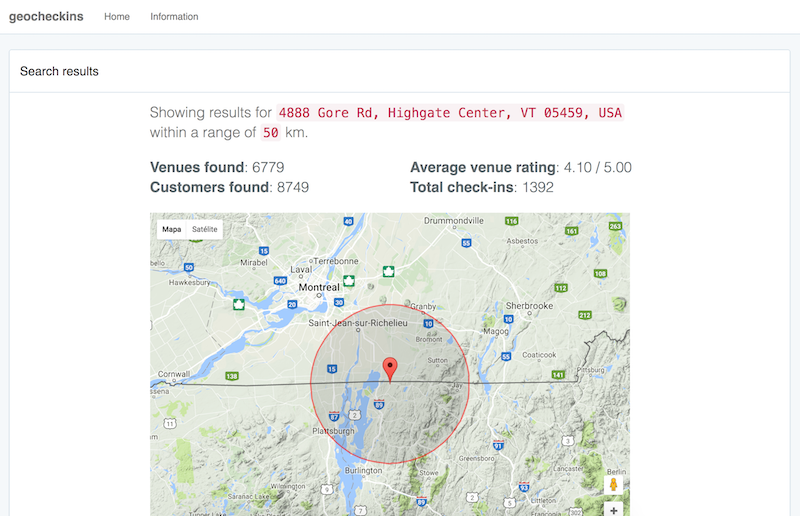

# geocheckins

`geocheckins` is a simple web application that generates useful geographical information about customers, venues and their check-ins on Foursquare social network. The application was developed as an assignment for the UbiComp course at Universidade Federal de Minas Gerais (UFMG) by doctoral student Habib Asseiss Neto.

## Demo

There is a demo instance of the application available at:
http://geocheckins.hneto.com

## Dataset

The dataset used in this application contains 2153471 users, 1143092 venues, 1021970 check-ins, 27098490 social connections, and 2809581 ratings that users assigned to venues; all extracted from the Foursquare application through the public API.

The dataset was obtained from:
https://archive.org/details/201309_foursquare_dataset_umn

## Geolocation calculations

Most records from the dataset have `latitude` and `longitude` attributes corresponding to a geolocation when certain events occur.

The application uses the coordinates to calculate the venues and customers found within a certain range in kilometers. The Haversine formula is used for computing great-circle distances between two pairs of coordinates on a sphere. More information can be found here:
https://developers.google.com/maps/articles/phpsqlsearch_v3#finding-locations-with-mysql

## Google Maps API

Google Maps API is used to display the map of the requested address.

Google Maps API documentation is found at:
https://developers.google.com/maps/documentation/

## csv-converter

It is provided a script that converts the format of existing data files to a regular csv format.

The script expects the input file and the output file as parameters:

`python csv-converter.py in.dat out.csv`

The obtained format is shown below.
```
id    |       latitude        |       longitude       
---------+-----------------------+-----------------------
101759 |            45.5405832 |           -73.5965186
101762 |            45.5154736 |           -73.5643264
449060 |             38.962166 |            -94.604425
...
```

The `csv-converter` script will translate it to a regular csv file, as shown below.

```
id,latitude,longitude
101759,45.5405832,-73.5965186
101762,45.5154736,-73.5643264
449060,38.962166,-94.604425
...
```

Using the converted csv file it is possible to import data to any database table.

## Importing large datasets into server

Because the csv files are usually very large, the recommended way of importing it to a database server is by command line on the server itself.

Use `mysql -u user -p` command to enter the database console, then use the following command to import the csv file to the specified table:

```
LOAD DATA LOCAL INFILE 'venues.csv'
INTO TABLE venues
FIELDS TERMINATED BY ','
LINES TERMINATED BY '\n'
IGNORE 1 LINES
(@col1,@col2,@col3) set id=@col1,latitude=@col2,longitude=@col3;
```

## Screenshot


